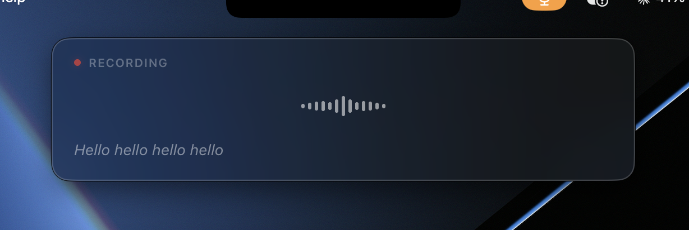
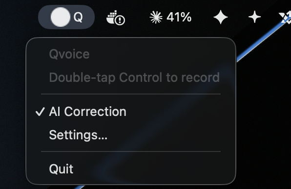
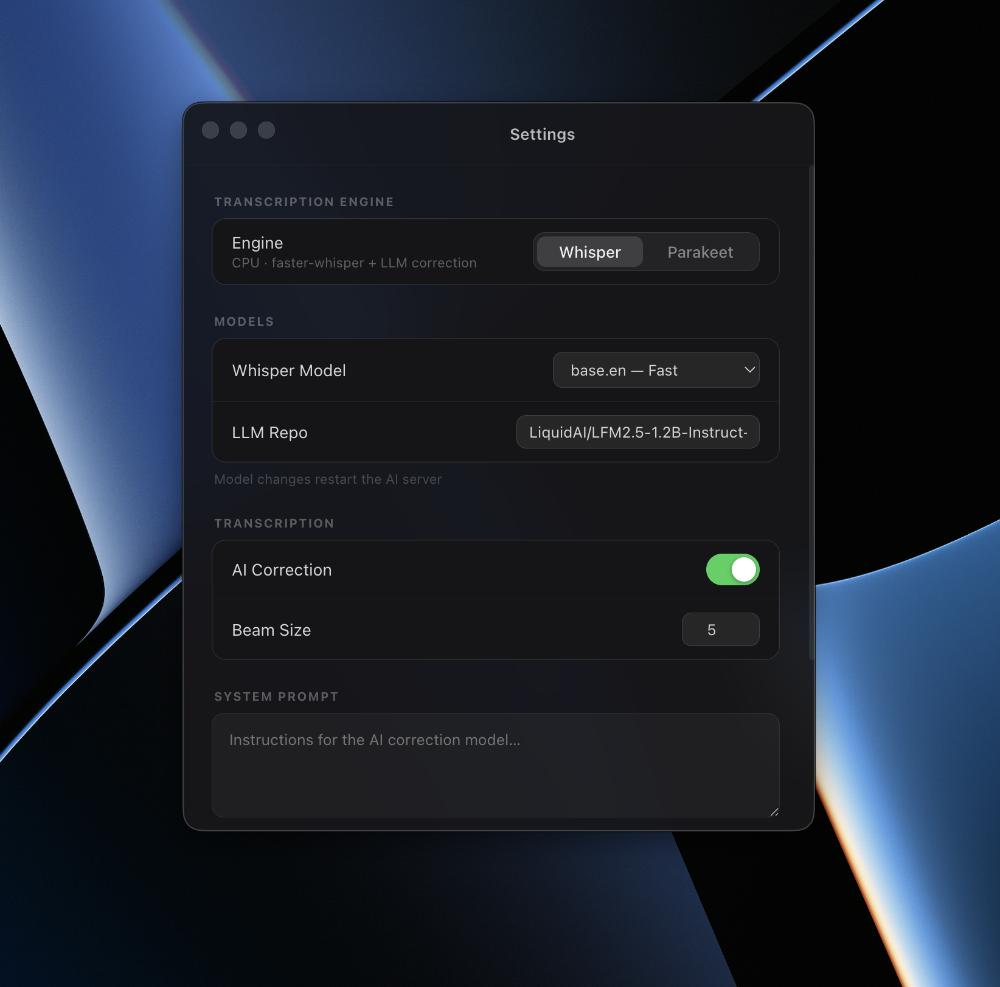

# Qvoice

Local voice-to-text for macOS. Double-tap **Control** to record, double-tap again to transcribe and paste — all on-device, no cloud, no subscription.

 

<br>



---

## Features

- **Double-tap Control** to start and stop recording
- **Live waveform** with real-time partial transcription while you speak
- **Two engines** — Whisper (CPU) or Parakeet (Apple Silicon GPU)
- **LLM correction** via LiquidAI LFM2.5 — fixes grammar, punctuation, and mishears
- **Preview or auto-paste** — review before committing, or skip straight to clipboard
- **Menu bar app** — no dock icon, always available

<br>



---

## Requirements

- macOS 12+
- [Node.js](https://nodejs.org) 18+
- [uv](https://github.com/astral-sh/uv) — `brew install uv`

## Setup

```bash
git clone https://github.com/Qyrhal/Qvoice
cd Qvoice
bash setup.sh
npm start
```

The setup script creates a Python 3.12 venv and installs all dependencies. On **first launch**, models are downloaded and cached automatically.

## Permissions

Two macOS permissions are required on first use:

- **Accessibility** — for the global double-Control hotkey  
  System Settings → Privacy & Security → Accessibility → add your terminal
- **Microphone** — prompted automatically on first recording

---

## Settings



Open via the **Q** menu bar icon → Settings.

| Setting | Description |
|---|---|
| Engine | **Whisper** (CPU, all Macs) or **Parakeet** (Apple Silicon GPU, faster) |
| Whisper Model | `tiny.en` → `large-v3` — trade speed for accuracy |
| LLM Repo | HuggingFace repo for the correction model |
| AI Correction | Toggle LLM grammar/punctuation correction on or off |
| Beam Size | Whisper beam search width (1 = fastest, 5 = default) |
| System Prompt | Instructions for the correction model |
| Auto Paste | Paste immediately, or show a preview to confirm first |

Model changes restart the AI server. All other settings apply to the next recording.

---

## Models

Models are downloaded on first use and cached in `~/.cache/huggingface/`.

| Model | Size | Purpose |
|---|---|---|
| Whisper `base.en` | ~140 MB | Speech-to-text (default) |
| LFM2.5 1.2B (6-bit MLX) | ~900 MB | Grammar & error correction |
| Parakeet TDT 0.6B | ~600 MB | Alternative ASR (Apple Silicon) |

---

## Tech stack

| Layer | Technology |
|---|---|
| App shell | [Electron 42](https://electronjs.org) |
| UI | [React 19](https://react.dev) + [Vite](https://vitejs.dev) |
| Glass effect | [@liquid-dom/react](https://github.com/pickle-com/glass) |
| Global hotkey | [uiohook-napi](https://github.com/SnosMe/uiohook-napi) |
| Whisper engine | [faster-whisper](https://github.com/SYSTRAN/faster-whisper) |
| Parakeet engine | [parakeet-mlx](https://github.com/senstella/parakeet-mlx) |
| LLM correction | [mlx-lm](https://github.com/ml-explore/mlx-lm) + LiquidAI LFM2.5 |
| Audio | 16 kHz mono WAV, encoded in-browser (no ffmpeg) |
| Paste | AppleScript `System Events` keystroke |

## License

MIT — see [LICENSE](LICENSE).
